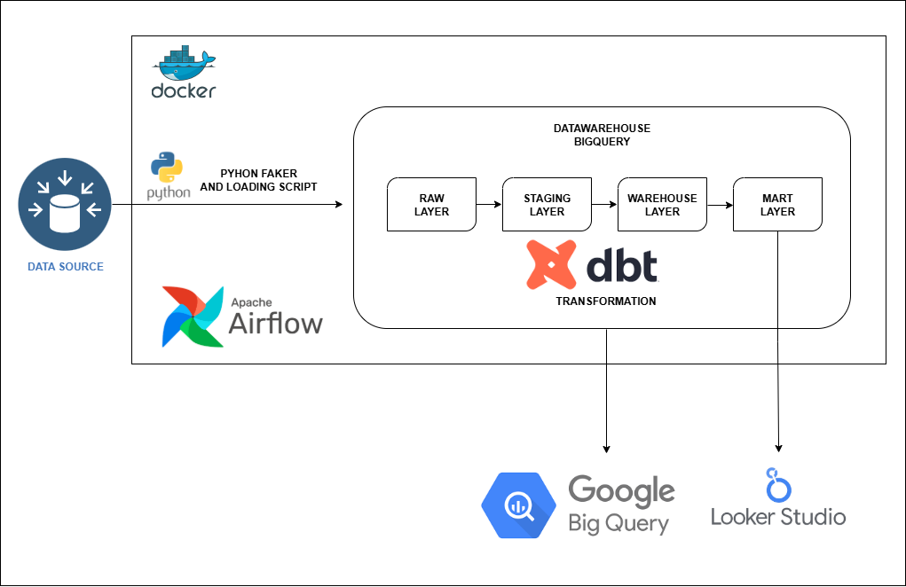
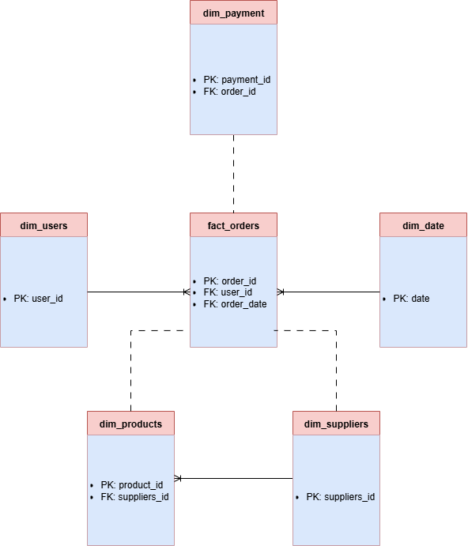
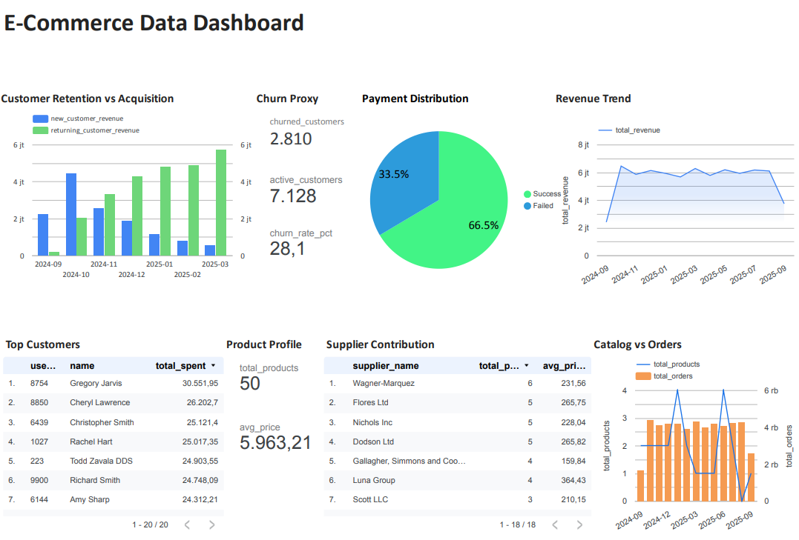

# Final Project Report — Ecommerce Analytics

## 1. Background Project
**Domain:** Ecommerce 🛒  
**Alasan Pemilihan:**
- Familiar dan mudah dipahami.
- Data bervariasi (users, produk, transaksi, pembayaran).
- Banyak metrik bisnis menarik (retention, churn, top customers, payment distribution, revenue trend, product profile, supplier contribution, catalog vs orders).
- Dummy data mudah digenerate dengan Python Faker.
- Insight bermanfaat & relevan untuk dunia nyata.

**Tujuan:**  
Membangun **end-to-end data pipeline** untuk menghasilkan insight bisnis dari data Ecommerce.  
Pipeline ini mengintegrasikan **Python, Airflow, DBT, BigQuery, dan Looker Studio**.

---

## 2. Arsitektur Pipeline

**Alur pipeline:**
Python (Faker) → Airflow → BigQuery (Raw → Staging → Warehouse → Mart) → Looker Studio Dashboard

- **Data Generator (Python + Faker):** membuat data dummy ecommerce.
- **Airflow:** orchestrasi ETL/ELT.
- **BigQuery:**
  - Raw layer → data mentah.
  - Staging layer → cleaning & normalisasi.
  - Warehouse → star schema (fact + dimension).
  - Mart → agregasi sesuai business questions.
- **Looker Studio:** visualisasi dashboard.

---

## 3. Schema Database

### Raw Layer
- **users, products, orders, order_items, payments, suppliers, shipments, reviews**

### Staging Layer
- **stg_users, stg_products, stg_orders, stg_order_items, stg_payments, stg_suppliers, stg_shipments, stg_reviews**

### Warehouse Layer (Hybrid Star–Snowflake Schema)

- **Fact:**  
  - `fact_orders` (tabel fakta agregat di level pesanan + revenue, qty, dll.)

- **Dimensions:**  
  - `dim_users`
  - `dim_products`
  - `dim_suppliers`
  - `dim_payments`
  - `dim_dates`

### Mart Layer
- `mart_catalog_vs_orders`
- `mart_churn_proxy`
- `mart_customer_retention`
- `mart_payment_distribution`
- `mart_product_profile`
- `mart_revenue_trend`
- `mart_supplier_contribution`
- `mart_top_customers`

---

## 4. Layering Rules

- **Raw:** data hasil load tanpa transformasi.
- **Staging:** cleaning, casting tipe data, dedup.
- **Warehouse:** star schema → fact + dimension, optimalkan join.
- **Mart:** tabel khusus untuk menjawab pertanyaan bisnis.

---

## 5. Business Questions

✨ **Utama (unik & menarik):**
- Customer Retention vs Acquisition → kontribusi revenue pelanggan lama vs baru.
- Churn Proxy → pelanggan yang berhenti belanja dalam ≥3 bulan terakhir.

✨ **Standar (pelengkap dashboard):**
- Revenue Trend.
- Payment Distribution.
- Top Customers.

✨ **Opsional (hiasan):**
- Product Profile.
- Supplier Contribution.
- Catalog vs Orders.

---

## 6. Tahapan Project

- **1** → Domain, scope, business questions, tools.
- **2** → Data generator (Python Faker).
- **3** → Load raw data ke BigQuery dengan Airflow.
- **4** → Staging Layer dengan dbt + test.
- **5** → Warehouse Layer (Star Schema fact/dim).
- **6** → Mart Layer (business case specific).
- **7** → Data Quality & pipeline testing.
- **8** → Dashboard di Looker Studio.
- **9** → Dokumentasi Project.

---

## 7. Dashboard

**Link Dashboard:** [Looker Studio Link](https://lookerstudio.google.com/reporting/21d7d26b-469d-49c3-b478-c61b6b3d5132)

Isi dashboard:
- Customer Retention vs Acquisition.
- Churn Proxy.
- Revenue Trend.
- Payment Distribution.
- Top Customers.
- Product Profile.
- Supplier Contribution.
- Catalog vs Orders.

---

## 8. Kendala & Solusi

- **Masalah versi dbt & adapter BigQuery**  
  ✅ Fix: rebuild Docker image, sesuaikan versi dbt-core & dbt-bigquery.
  
- **Duplikasi data di staging**  
  ✅ Fix: gunakan `row_number()` untuk dedup.
  
- **Error line_total test**  
  ✅ Fix: tambahkan dbt_utils + perbaikan schema.yml.
  
- **Airflow tidak kenal `dbt`**  
  ✅ Fix: custom Dockerfile untuk install dbt-core & dbt-bigquery.

---

## 9. Kesimpulan
Project ini berhasil membangun pipeline end-to-end:
- Data dummy → BigQuery Raw → Staging → Warehouse (Hybrid Star–Snowflake Schema) → Mart → Dashboard.
- Mendapatkan insight Customer Retention vs Acquisition, Churn Proxy, Revenue Trend, Payment Distribution, Top Customers, Product Profile, Supplier Contribution, Catalog vs Orders.
- Pipeline terotomasi dengan Airflow, dapat diulang (idempotent), dan teruji dengan dbt test.

